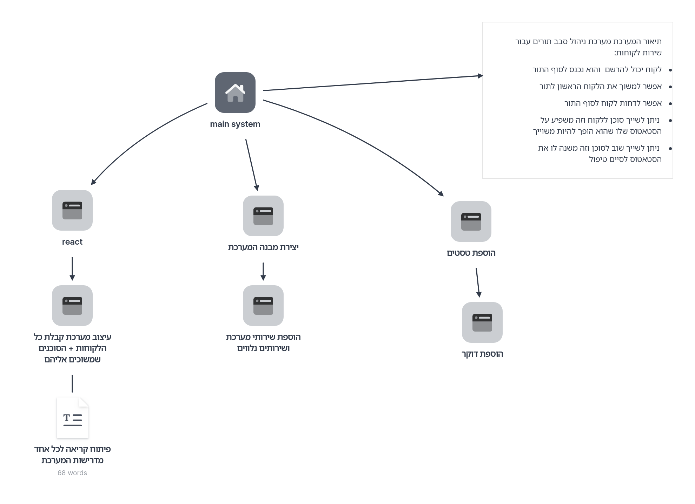

# Queue System Project

מערכת לניהול תורים עם Node.js + MongoDB + React.

---

## איפיון הפרוייקט


## 🚀 הוראות הפעלה

### 1. הורדת הפרויקט
```bash
git clone https://github.com/your-username/queue-system.git
cd queue-system
npm install
cd client
npm install
```

## 🏁 הרצת הפרויקט

### בתיקיית השורש של הפרויקט
```bash
npm run dev
```

### בתיקיית client של הפרויקט
```bash
cd client
npm run start:3001
```

### 🧪 טסטים ל־Backend
```bash
npx jest tests/queueRoutes.test.js
```

##  ⚙️ קובץ סביבה (.env)
### בתיקיית השורש של הפרויקט
```bash
MONGO_URI=mongodb://localhost:27017/queue-system
PORT=5000
```
### בתיקיית client של הפרויקט cd client
```bash
REACT_APP_API_URL=http://localhost:3000
```


